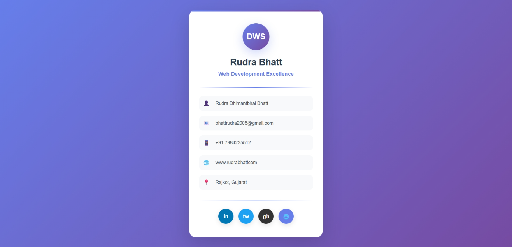

# 🌐 Digital Business Card

A simple **Business Card Website** built with **HTML & CSS** to showcase personal details like **name, profession, contact, and social links**.  
This project provides a clean, modern, and responsive digital alternative to traditional visiting cards.

---

## ✨ Features
- 🎨 **Modern UI** with gradient backgrounds and smooth hover effects  
- 🧑‍💼 **Personal & Professional details** (Name, Email, Phone, Address, Website)  
- 🔗 **Social Media Links** (LinkedIn, Twitter, GitHub, Website)  
- 📱 **Fully Responsive** design (works on mobile, tablet, and desktop)  
- 💡 **Expandable** into a personal portfolio site  

---

## 🖥️ Demo Preview


---

## 🛠️ Technologies Used
- **HTML5** – structure  
- **CSS3** – styling & responsiveness  

---

## 📂 Project Structure
```
digital-business-card/
│── index.html   # Main Business Card Website
│── README.md    # Project documentation
```

---

## 🚀 Getting Started

### 1️⃣ Clone the Repository
```bash
git clone https://github.com/RUDRA-555/digital-business-card.git
```

### 2️⃣ Navigate to Project
```bash
cd digital-business-card
```

### 3️⃣ Run the Website
Simply open `index.html` in your browser.

---

## 📌 Future Enhancements
- ✅ Add **QR Code** linking to website/portfolio  
- ✅ Include **Download vCard** option  
- ✅ Add **Dark Mode** toggle  
- ✅ Deploy live with **GitHub Pages**  

---

## 👤 Author
**Rudra Bhatt**  
📧 [bhattrudra2005@gmail.com](mailto:bhattrudra2005@gmail.com)  
📍 Rajkot, Gujarat  

---

## 🌟 Show Your Support
If you like this project, give it a ⭐ on [GitHub](https://github.com/RUDRA-555/digital-business-card)!
